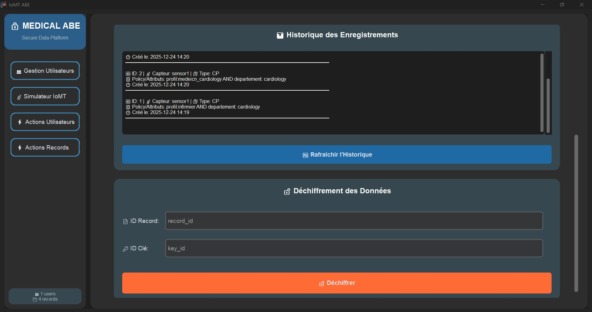
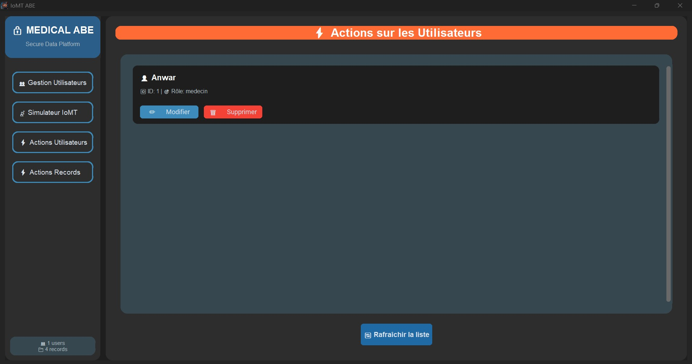

# IoMT-ABE-Simulation (CustomTkinter Desktop)

## Description
Version desktop du projet **IoMT-ABE-Simulation**, utilisant **CustomTkinter** pour l’interface graphique.  
Il s’agit d’une **simulation pédagogique** : les algorithmes **CP-ABE** et **KP-ABE** sont simulés dans  
`abe/sim_abe.py` à l’aide d’un **chiffrement hybride (Fernet)** et d’une évaluation simple des politiques d’accès.

---

## Fonctionnalités
- Simulation des modèles **KP-ABE** et **CP-ABE**
- Gestion des politiques d’accès basées sur les attributs
- Interface graphique desktop avec **CustomTkinter**
- Base de données locale **SQLite** via **SQLAlchemy**
- Approche pédagogique pour comprendre l’ABE

---

## Captures d’écran

### Écran 1 – Interface principale


### Écran 2 – Sélection du modèle ABE


### Écran 3 – Définition des attributs


### Écran 4 – Politique d’accès


### Écran 5 – Chiffrement et stockage


### Écran 6 – Déchiffrement et résultats


---

## Contenu du projet
- `main.py` : application desktop (GUI) avec CustomTkinter  
- `abe/sim_abe.py` : simulateur ABE (CP-ABE & KP-ABE)  
- `models.py` : modèles SQLAlchemy (SQLite local : `data.db`)  
- `requirements.txt` : dépendances Python  
- `screenshots/` : captures d’écran de l’application  

---

## Installation rapide

### 1️⃣ Créer et activer un environnement virtuel
```bash
python -m venv venv
